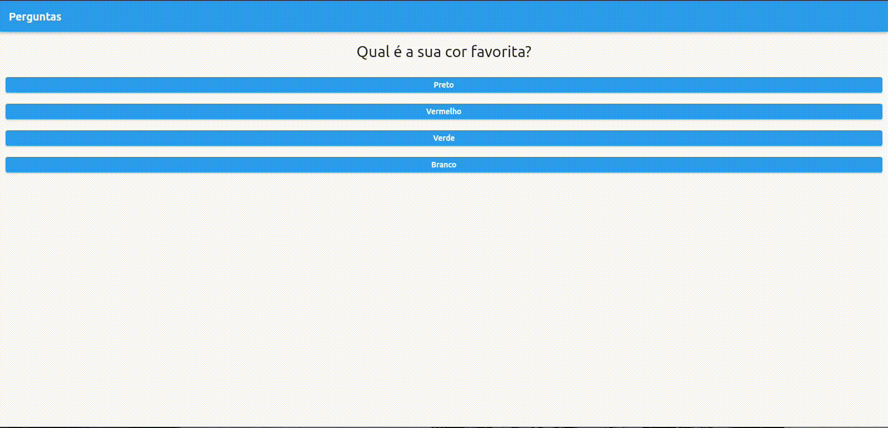
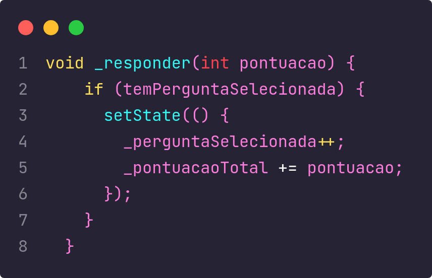

# Quiz App 🎯

_Bem-vindo à documentação do Quiz App. Um aplicativo de quiz simples, desenvolvido em Flutter para por em pratica meus conhecimentos._



---

## Menu

- [Sobre o Projeto](#sobre-o-projeto)
- [Tecnologias Utilizadas](#tecnologias-utilizadas)
- [Destaque](#destaque)
- [Como Usar](#como-usar)
- [Funcionalidades](#funcionalidades)
- [Contribuição](#contribuição)
- [Redes Sociais](#redes-sociais)
- [Licença](#licença)

---

## Sobre o Projeto

O Quiz App é um aplicativo de quiz interativo que permite aos usuários responderem perguntas.

## Tecnologias Utilizadas


## Destaque



## Como Usar

1. **Instale o Projeto:**

   ```bash
   git clone https://github.com/SEU_USUARIO/quiz_app.git
   cd quiz_app
   ```

2. **Execute a Aplicação:**

   ```bash
   flutter run
   ```

3. **Inicie o Quiz:**

   Abra o aplicativo, e inicie o desafio para testar seus conhecimentos.

## Funcionalidades

- **Perguntas Aleatórias:** O aplicativo apresenta perguntas aleatórias
- **Pontuação:** Os usuários podem ver sua pontuação ao final do quiz e compará-la com jogos anteriores.

## Contribuição

Sinta-se à vontade para contribuir para o desenvolvimento deste projeto ou relatar problemas. Abra uma issue ou envie um pull request para o [repositório no GitHub](https://github.com/GUSTAV0DEDEUS/Quiz).


## Redes Sociais

[](https://www.linkedin.com/in/gustavo-de-deus-conceicao/)
[](https://github.com/GUSTAV0DEDEUS)
[](https://www.instagram.com/decode0001/)
<a href="https://www.youtube.com/@deCode001">
  
</a>

## Licença

Este projeto é licenciado sob a [Licença MIT](./LICENSE).

---

## Autor

Gustavo De Deus Conceição (Desenvolvedor Fullstacks)